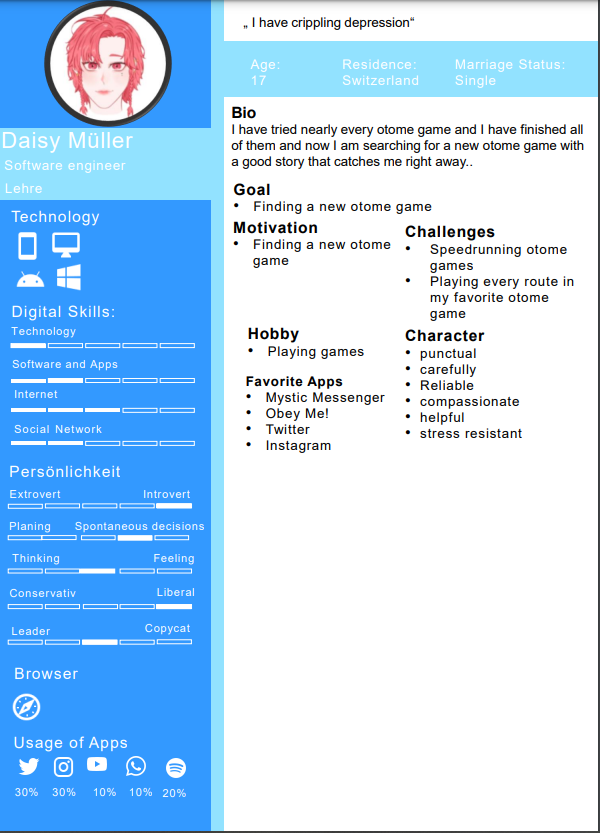

# **Incidentally in love Documentation**

> by Eslem Akdemir, Elisa Petit-Sirigu, Marton Naray, Sandro Casadei, Nico Delvecchio, Dominik Kreiselmaier, Ahmad Becirovic

## Introduction

### About our Game

> What is an otome game?
>
> An otome game, is a story-based video game that is targeted towards women. Generally one of the goals, besides the main idea/goal, is to develop a romantic relationship between the female player/main character and one of the second-lead male characters.
>
> [Source](https://www.wikiwand.com/en/Otome_game)

### Technologies

* Unity: 2021.3.6f1
* C#
* Dialog tree

## Installation

## Description

## Planning

### Requirements

| Nomber | Must? Can? | Quality, Functional, Extra | Description                            |
| -------- | ------------ | ---------------------------- | ---------------------------------------- |
| 1      | Must       | Functional                 | A stoy for our game has to be creaded  |
| 2      | Must       | Functional                 | Messeges have to be written            |
| 3      | Must       | Functional                 | a) Write Instruction / story mode text |
| 4      | Must       | Functional                 | b) Write messege text                  |
| 5      | Must       | Functional                 | c) write possible answers for the user |
| 6      | Must       | Functional                 | create the story mode                  |
| 7      | Must       | Functional                 | Create the messege mode                |
| 8      | Must       | Functional                 | create a plan of the gameprocess       |
| 9      | Must       | Quality                    | The game process must be saved         |

### Persona

### UML

### Flowchart

### Mockup

## Story

### Ideas

* The characters are part of a secret intelligence agency (SIA) and the MC is a victim stalking that gets attacked one night and Ciel saves her and brings her to the headquarters of the SIA
* The MC unkowingly is the child of the villain of the story
* The stalker is actually a subordinate of the dad (aka villain) and the dad doesn't know that the child is alive but the subordniate does
* The stalker (yuki) is actually in "love" with the MC which is the reason he is risking getting in trouble by not telling the MC's dad that they're still alive
* The dad wants the MC dead because he sees family as a weakness
* The SIA tries to help her and they then uncover the truth about the MC (which the MC isn't even aware of) and momentarily think of them as a traitor

### Script

### Plot

## Characters

### Ciel

---

#### Information

Age: 21

Birthdate: 7. April

Zodiac sign: Aries

Gender: Male

#### Personality

* ENFP
* impulsive
* disorganized
* usually he doesn't take things seriously but he can get really serious really easily
* really creative

#### Love language test

| Love Language        | Percentage |
| ---------------------- | ------------ |
| Words of affirmation | 40%        |
| Physical touch       | 27%        |
| Quality time         | 23%        |
| Acts of service      | 7%         |
| Receiving gifts      | 3%         |

#### Story

Ciel used to get bullied for being too feminine and weird. His classmates would discreetly hit him and lock him up in small spaces and throw things at him. One time one of his bullies injured his forhead which caused a scar that is visible even now but that was the last straw for Ciel and he fought back for the first time. Nowadays he has severe anger issues that are caused by his past trauma.

#### Route & Endings

##### Good ending

##### Normal ending

##### Bad ending

#### Character Design

#### Interests & hobbies

* Martial arts
* Art
* Cute things (Teddy bears, cats etc.)

### Stellan

---

#### Information

Age: 24

Birthdate: 12. July

Zodiac sign: Cancer

Gender: Male

#### Personality

* ENFJ
* really loud, talks way too much
* cheerful
* sympathetic
* organised
* really likes routines
* hates arguments and discussions, especially when people get loud
* though he is quite loud, he gets really silent when people see his scars or when it's about his past/issues

#### Love Language test

| Love Language        | Percentage |
| ---------------------- | ------------ |
| Physical touch       | 35%        |
| Acts of service      | 32%        |
| Quality time         | 16%        |
| Receiving gifts      | 10%        |
| Words of affirmation | 6%         |

#### Story

Stellan used to be abused by both of his parents all his life back when he lived with his parents. He ran away from home as soon as he turned 18 and the leader (?) of the SIA he took him and trained him personally. He suffers from depression and has issues with selfharm. Therefore he has a lot of scars on his arms and thighs from selfharming and a few on his back from his parents, which is why he always wears long sleeved clothes.

#### Route & Endings

##### Good ending

##### Normal ending

##### Bad ending

#### Character Design

#### Interests & hobbies

* Anime
* Games
* Mangas
* Cars

### Jude (Not filled out)

---

#### Information

Age: 27

Birthdate: 7. April

Zodiac sign: Aries

Gender: Female

#### Personality

#### Love Language test

| Love Language        | Percentage |
| ---------------------- | ------------ |
| Words of affirmation | 40%        |
| Physical touch       | 27%        |
| Quality time         | 23%        |
| Acts of service      | 7%         |
| Receiving gifts      | 3%         |

#### Story

#### Route & Endings

##### Good ending

##### Normal ending

##### Bad ending

#### Character Design

#### Interests & hobbies

### Blake (Not filled out)

---

#### Information

Age: 21

Birthdate: 7. April

Zodiac sign: Aries

Gender: Male

#### Personality

#### Love Language test

| Love Language        | Percentage |
| ---------------------- | ------------ |
| Words of affirmation | 40%        |
| Physical touch       | 27%        |
| Quality time         | 23%        |
| Acts of service      | 7%         |
| Receiving gifts      | 3%         |

#### Story

#### Route & Endings

##### Good ending

##### Normal ending

##### Bad ending

#### Character Design

#### Interests & hobbies

### Yuki (Not filled out)

---

#### Information

Age: 21

Birthdate: 7. April

Zodiac sign: Aries

Gender: Male

#### Personality

#### Love Language test

| Love Language        | Percentage |
| ---------------------- | ------------ |
| Words of affirmation | 40%        |
| Physical touch       | 27%        |
| Quality time         | 23%        |
| Acts of service      | 7%         |
| Receiving gifts      | 3%         |

#### Story

#### Route & Endings

##### Good ending

##### Normal ending

##### Bad ending

#### Character Design

#### Interests & hobbies

## Design

### Color Palette

### Chatrooms

### Messages

### Story mode

## Programming

### Requierements

### Testing
